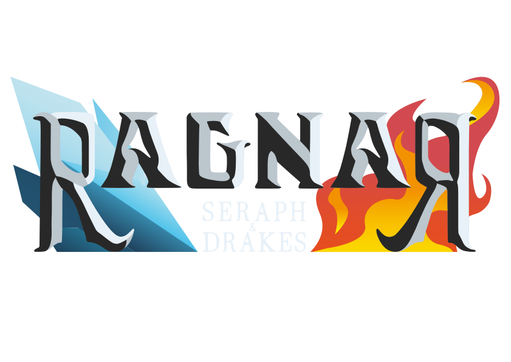
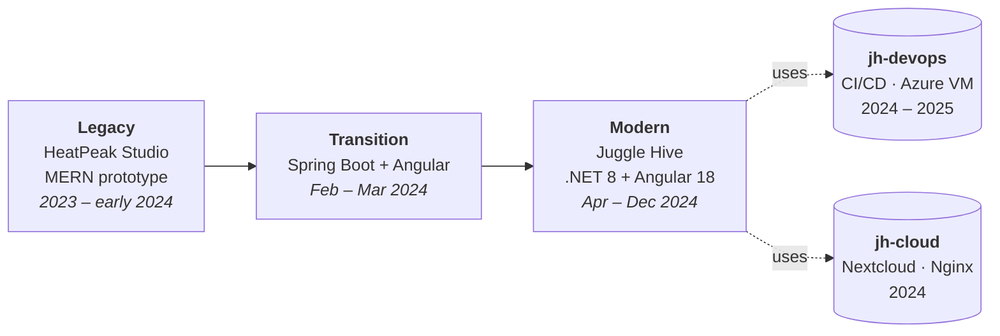
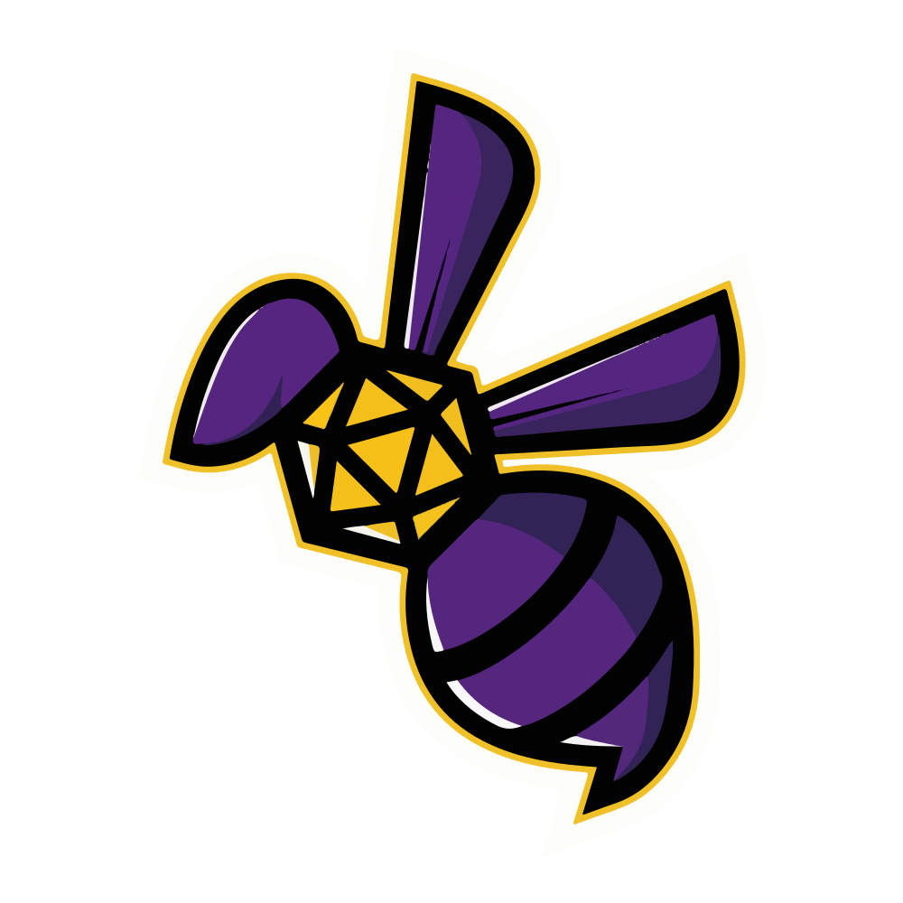

<div align="center">
  
</div>

# Ragnar TTRPG Platform

[](https://creativecommons.org/licenses/by-nc-nd/4.0/)


## Overview

This is a **unified portfolio monorepo** that gathers the complete evolution of the **Ragnar TTRPG Platform** — a project that set out to bring tabletop role-playing games into the browser, and that was rebuilt three times as the team and its technology matured.

Rather than living in five separate repositories, every implementation is preserved here as a subdirectory **with its full, original commit history merged into `main`** (via subtree merges). The five source branches also remain available unchanged for reference. In other words: `git log -- jh-main/` walks the modern app's real, full commit history (back to its first commit), not a single squashed import.

> **Status:** archived. The platform is no longer under active development; it is published as an engineering portfolio.

## Evolution



The application was rebuilt across three phases, supported by two infrastructure projects:

| Aspect | Legacy (`hp-main`) | Transition (`hp-jh-transition`) | Modern (`jh-main`) |
|--------|--------------------|----------------------------------|--------------------|
| **Frontend** | React 18 + Vite 4 | Angular 17 + NgRx 17 | Angular 18 + NgRx 18 |
| **Backend** | Node.js + Express 4 | Spring Boot 3.2 (Java 17) + Maven | .NET 8 + EF Core 8 |
| **Database** | MongoDB + Mongoose 7 | PostgreSQL + Spring Data JPA | PostgreSQL (Npgsql) |
| **Cloud / Assets** | Static `references/` images | — | Azure File Storage (via SAS) |
| **CI/CD** | GitHub Actions → Docker Hub | Dockerfile + GitHub Actions | GitHub Actions → GHCR |

> All versions, frameworks, and integrations in this table are taken directly from the committed `package.json` / `pom.xml` / `.csproj` and workflow files of each phase. Authentication was never implemented beyond CORS + Helmet hardening on the legacy backend, so no auth claims are made here.

Supporting infrastructure:

- **`jh-devops`** — GitHub Actions CI/CD, Azure VM lifecycle management (start/stop/backup), Terraform provisioning, Docker + Nginx.
- **`jh-cloud`** — Docker Compose stack for self-hosted Nextcloud behind Nginx with Let's Encrypt SSL automation.

## Project Structure

```text
├── hp-main/              # Legacy MERN implementation (HeatPeak Studio)
├── hp-jh-transition/     # Spring Boot + Angular transition phase
├── jh-main/              # Modern Angular / .NET 8 implementation (Juggle Hive)
├── jh-devops/            # DevOps infrastructure and CI/CD
├── jh-cloud/             # Cloud services and containerization
├── icons/                # Project logos (Ragnar, HeatPeak Studio, Juggle Hive)
├── .mailmap              # Canonical author identities
├── CONTRIBUTING.md
├── .gitignore
├── LICENSE.md
└── README.md
```

Each subdirectory contains a complete sub-project with its own README. Click a folder to browse it inline on `main`, or jump to the matching original branch (flat layout):

| Implementation | Folder on `main` | Original branch |
|----------------|------------------|-----------------|
| Legacy — MERN | [`hp-main/`](hp-main/) | [`hp-main` ↗](https://github.com/morph-eos/ragnar-ttrpg-platform/tree/hp-main) |
| Transition — Spring + Angular | [`hp-jh-transition/`](hp-jh-transition/) | [`hp-jh-transition` ↗](https://github.com/morph-eos/ragnar-ttrpg-platform/tree/hp-jh-transition) |
| Modern — .NET 8 + Angular 18 | [`jh-main/`](jh-main/) | [`jh-main` ↗](https://github.com/morph-eos/ragnar-ttrpg-platform/tree/jh-main) |
| DevOps — CI/CD + Azure | [`jh-devops/`](jh-devops/) | [`jh-devops` ↗](https://github.com/morph-eos/ragnar-ttrpg-platform/tree/jh-devops) |
| Cloud — Nextcloud | [`jh-cloud/`](jh-cloud/) | [`jh-cloud` ↗](https://github.com/morph-eos/ragnar-ttrpg-platform/tree/jh-cloud) |

## Exploring the History

Because each implementation was merged with its history intact, the evolution is fully navigable from `main`:

```bash
# Real commit history of any single implementation
git log --oneline -- jh-main/
git log --oneline -- hp-main/

# Jump straight to a phase milestone (annotated tags)
git show v1-legacy      # legacy MERN integrated
git show v2-transition  # Spring Boot + Angular integrated
git show v3-modern      # modern .NET 8 + Angular 18 integrated

# Consolidated contributor list (uses .mailmap)
git shortlog -sne
```

The original branches remain available unchanged for reference:

```bash
git checkout hp-main hp-jh-transition jh-main jh-devops jh-cloud
```

## Getting Started

```bash
git clone https://github.com/morph-eos/ragnar-ttrpg-platform.git
cd ragnar-ttrpg-platform

cd hp-main/              # Legacy MERN implementation
cd jh-main/              # Modern Angular / .NET 8 implementation
cd hp-jh-transition/     # Spring Boot transition phase
cd jh-devops/            # DevOps infrastructure
cd jh-cloud/             # Cloud services
```

## Development Team

<div align="center">
  <table>
    <tr>
      <td align="center">
        
        <br><strong>HeatPeak Studio</strong>
        <br><sub>Original Development</sub>
      </td>
      <td align="center">
        
        <br><strong>Juggle Hive</strong>
        <br><sub>Modern Development</sub>
      </td>
    </tr>
  </table>
</div>

- **Stefano Sciacovelli** ([GitHub](https://github.com/morph-eos) · [LinkedIn](https://www.linkedin.com/in/stefanosciacovelli)) — Lead Developer, DevOps, Project Manager
- **Paolo Nicola Leovino** ([LinkedIn](https://www.linkedin.com/in/paolonicolaleovino/)) — Game Designer, Project Manager
- **Alessia Grassi** ([LinkTree](https://linktr.ee/alessiagrassi) · [LinkedIn](https://www.linkedin.com/in/alessia-grassi-game-artist)) — UI/UX Designer
- **Davide Gritta** ([GitHub](https://github.com/GrittaGit) · [LinkedIn](https://www.linkedin.com/in/davide-gritta-18a6812ab)) — Backend Developer, Database Designer (`jh-main`)
- **Gianluca Rossetti** ([GitHub](https://github.com/Ross9519) · [LinkedIn](https://www.linkedin.com/in/gianluca-rossetti-6b1489264)) — Full-Stack Developer (`jh-main`)

## License

This project is licensed under the [Creative Commons Attribution-NonCommercial-NoDerivatives 4.0 International License](https://creativecommons.org/licenses/by-nc-nd/4.0/). See [LICENSE.md](LICENSE.md).

For commercial licensing inquiries, please contact the development team.
